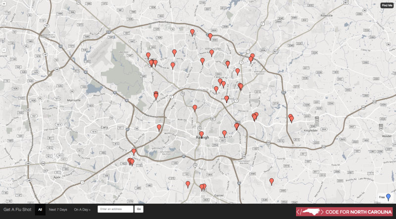

We were so impressed by the work that [@tkompare](https://github.com/tkompare) did on his [Chicago Flu Shots](https://github.com/tkompare/flushots2013) web application for the 2013 flu season, that we decided to fork and improve upon it for the 2014 season. Our version has one big change - instead of being based on [Google Fusion Tables](https://tables.google.com/), it's instead powered by a [Socrata Open Data API](http://dev.socrata.com).

## About the Flu Shot Finder

Given data about the location and hours of flu shot providers in your area, this application will help you locate the nearest place you can get the flu vaccine. It will even use geolocation in your browser to help find the nearest provider to your current location.

## Modifying 

1. [Fork the repo on Github](https://github.com/socrata/flushots/fork) so that you have your own copy to work with.
2. Locate data about the location of flu shot providers in your area. Hopefully, your local or state government has already provided this data, but if not, you can learn more about data hosting below.
3. If your data is already compliant with the schema below, you'll be able to use the app mostly without modifications. However, you'll still need to modify a few things:
  1. You'll need to change `sodaUrl` in `js/main.js:91` to the [API Endpoint](http://dev.socrata.com/docs/endpoints.html) for your dataset.
  2. Modify the branding in the `.modal-cdph` div in `index.html` to reflect your own instance of the app.
  3. Replace the [Google Maps API](https://developers.google.com/maps/) key in `index.html` with your own key.
  4. Update the city in `js/main.js`
4. If your data isn't compliant with the schema below, you can remap your data schema in `js/main.js`

## Deploying

Flu Shots deployment using OpenShift

OpenShift is a platform-as-a-service (PaaS) that lets you quickly and easily deploy Django/Python apps to a production hosting environment. The OpenShift software is open source so you can either run it on servers that you own or rent, or you can use Redhat's hosted OpenShift service at http://openshift.redhat.com

######  Step 1: Sign Up for an Account

Go to here and sign up for an account. You only need to signup for a free account. Skip if you has already had an account there.

###### Step 2: Setup Your Publish Key

You will need a public key for connection between you and  OpenShift later. A public key is  a plain text file usually name id_rsa.pub that's located in ~/.ssh/. 

So if you are on a Mac, it's in /Users/[your_username]/.ssh/id_rsa.pub or if you are on Linux it's in /home/[your_user_name]/.ssh/id_rsa.pub. You need to copy content of this file and update it with OpenShift so OpenShift is aware of your public key. When you make a connection to OpenShift from the terminal (that is, when you SSH to your box and are pushing code), OpenShift will identify and authorize you by based on your public/private key.

If you are not familiar with the public key concept, [this tutorial](http://code.tutsplus.com/tutorials/ssh-what-and-how--net-25138) will give you a solid background for it.

###### Step 3: Setup Your Application

- Add an Application from https://openshift.redhat.com/app/console/applications
- Choose a type of application: PHP 5+ Cartridge
- Configure the application by adding a public url, url to your git respository and selecting a nearby region.

###### Step 4: Your application has been created.

- Following the instructions for making code changes
- Continue to the application overview page for additional settings

## Data Schema

- `facility_name` - The name of the facility providing the vaccinations
- `begin_date` -
- `begin_time` -
- `contact` -
- `cost` -
- `end_date` -
- `end_time` -
- `hours` -
- `id` -
- `latitude` -
- `longitude` -
- `notes` -
- `phone` -
- `recurrence_days` -
- `url` -
- `street1` -
- `street2` -
- `city` -
- `state` -
- `postal_code` -

## Data Hosting

If vaccine provider data is not provided by your local government on Socrata, do not despair! There are other options available as well.

- If you're a local community group, free hosting is available via the [Socrata Community Data Platform](https://communities.socrata.com/). Your organization can [sign up](http://hackathon-in-a-box.org/open-data-apis/community-groups.html) and be granted an account that'll allow you to upload your data to Socrata and self-host your own API.
- If you're a [Code for America Brigade](http://www.codeforamerica.org/brigade/), you can also [sign up for free hosting](https://brigades.opendatanetwork.com/learn-more) on the [Brigade Open Data Sharing Platform](https://brigades.opendatanetwork.com/).

## Contributing

We warmly welcome [pull requests](https://help.github.com/articles/using-pull-requests/), so if there are modifications or improvements you'd like to make, feel free to fork this repo and send them our way! Please note that we may modify your pull requests to make sure they work properly with the main fork of the app.

## Warranty

This is sample code provided by [Socrata](http://www.socrata.com). No warranties or guaranties of any kind are granted. The code is licensed under the [MIT License](LICENSE.TXT), so have at it!
